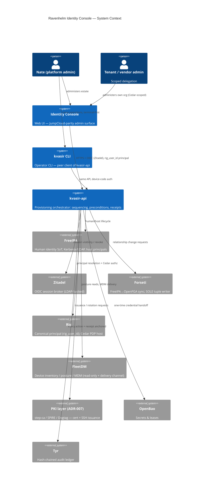
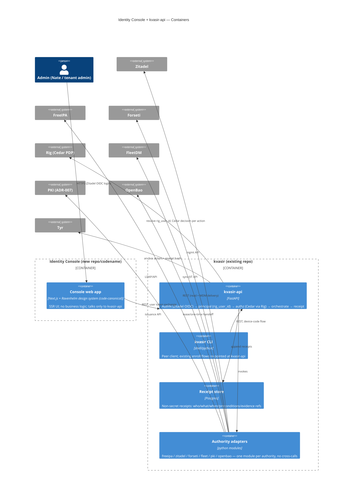
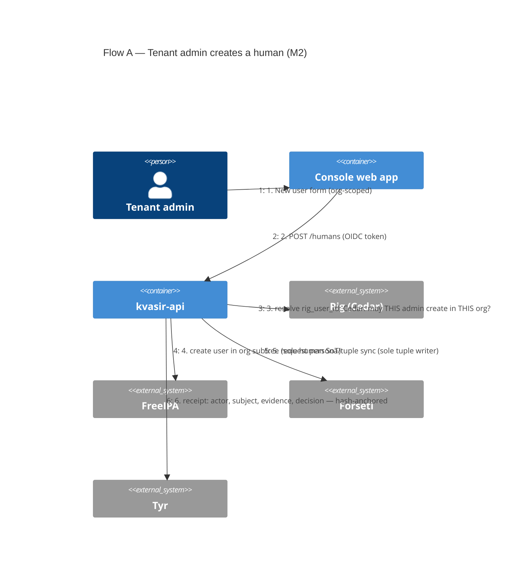
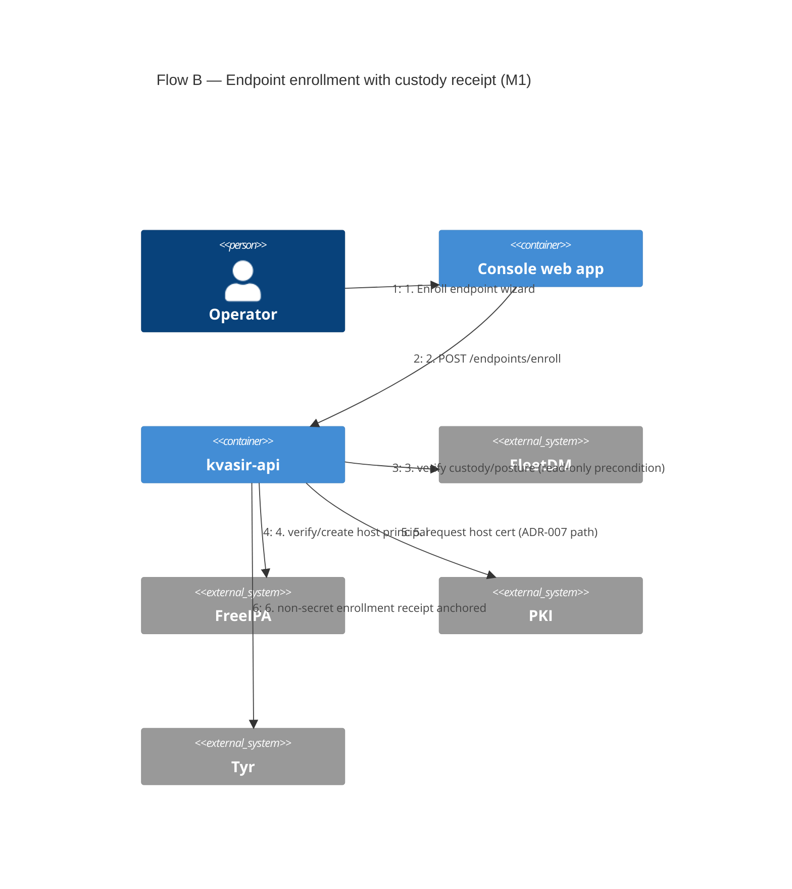

# Ravenhelm Identity Console — Full Plan

| Field | Value |
| --- | --- |
| Status | Draft — pending Nate's review |
| Owner | Nate Walker |
| Created | 2026-08-02 |
| Decision inputs | Q&A this session: full provisioning console · audience = Nate + tenant/vendor admins · Kvasir grows an API, UI + CLI are clients · all four domains in scope, phased |
| Governing ADR | Org-Wide Identity Provisioning & RBAC Schema (APPROVED 2026-07-17 — invariants bind) |
| Companion docs | `kvasir-product-vision.md` · `kvasir-endpoint-enrollment-mvp-prd.md` · runestack ADR-002 · (pending) runestack ADR-007 mTLS/PKI |
| Supersedes | The never-built "modify FleetDM's UI" idea — Fleet becomes a backend you stop opening |

## 1. What this is

A web console delivering the JumpCloud-parity feature set over the Ravenhelm
identity plane: FreeIPA (human SoT), Zitadel (OIDC broker), Forseti→OpenFGA
(relationships), Cedar via Rig (policy), FleetDM (device posture/MDM), OpenBao
(secrets), Tyr (audit), and — once ADR-007 lands — the step-ca/SPIRE PKI layer
for host/user/SSH/workload credentials.

**Kvasir stays true to its vision.** The vision doc says Kvasir is "not a
universal admin console" — and it remains not one. Kvasir's orchestration core
is promoted from CLI-internal logic to a service, **kvasir-api**, and the
console is a *client* of it, exactly as the CLI is. "Coordinates, never
absorbs" becomes an API contract. Every provisioning action — regardless of
surface — flows through kvasir-api and produces one receipt stream.

**Naming:** the console needs its own codename (Nate's call, per
repo-lifecycle). Referred to as "Console" throughout.

## 2. Binding constraints (from the approved ADR — not renegotiated here)

1. FreeIPA is the **sole** source of truth for human identity/groups/lock.
   The Console never creates a human anywhere else.
2. Forseti is the **sole** writer of OpenFGA tuples. The Console never touches
   OpenFGA directly — relationship changes are requests to Forseti.
3. Every service principals off **`rig_user_id`** — never raw `uid`/`sub`.
4. Zitadel is a session broker only; self-registration stays OFF.
5. Agent identities get authority via **Varar contracts only** — no standing
   grants. Service accounts follow `sa-platform-<svc>` / `sa-tenant-<id>-<svc>`.
6. Vendor orgs per the redline: vendor = external `org` (not a tenant),
   `serves`-edges fan out across tenants, `cn=vendors` trust-boundary subtree.
7. Secrets in OpenBao; no secret material ever transits or renders in the
   Console beyond one-time issuance handoffs.
8. Estate rules: no Tailscale-IP binds; internal calls use `ravenmask.net`
   names over the TLS internal entrypoint (Project A remediation); PR process
   via Forgejo once the repo migrates (verify remote before pushing).

## 3. Systems — C4 Level 1 (System Context)

## 4. Containers — C4 Level 2

Deployment: both containers on Norns k3s, internal names on `ravenmask.net`
via the TLS internal entrypoint (Project A), public name via Cloudflare only
for the browser-facing Console. Fleet/FreeIPA/Zitadel calls stay internal.

## 5. Dataflow — C4 dynamic view (two canonical flows)

Failure handling in both flows: kvasir-api is the only component allowed to
partially succeed; every step writes a receipt line (attempted → outcome), and
a failed sequence leaves a resumable receipt, never a silent half-state.
Adapters are idempotent (create-if-absent, verify-then-mutate) so retries are
safe.

## 6. Phased implementation

Everything below v1-scoped per this session's decisions; each milestone ships
usable value and is a Forgejo PR series with its own acceptance gate. Read
surfaces for **all** domains land in M0 — writability arrives per-milestone.

### M0 — Spine + read-only pane of glass
- `kvasir-api` skeleton: FastAPI, Zitadel OIDC (client-credentials for CLI
  device flow), principal resolution via Rig (`rig_user_id`), receipt store
  (Postgres, `create_all` gotcha noted — use migrations from day one), Tyr
  anchoring, per-org scoping middleware.
- Cedar authz for **console actions** — this activates Cedar for a real,
  bounded policy set. ⚠️ The 14-policy Cedar design is flagged in the ADR
  notes as a **design collab with Nate, not a subagent job**; M0 needs only
  the console-action subset (org-scoping + admin-role policies), drafted in
  that collab.
- Authority adapters, read paths only: FreeIPA (users/groups/hosts), Zitadel
  (sessions), Forseti/OpenFGA (relationship views), Fleet (device posture),
  OpenBao (lease metadata only).
- Console web app shell: Next.js + Ravenhelm design system; directory views —
  People, Devices, Services/Agents, Orgs, Credentials (empty until M3) — each
  entity page aggregating all authorities' views of that entity + its receipt
  history.
- **Gate:** tenant admin can log in and see exactly (and only) their org.
  Fleet's UI no longer needed for daily posture checks.

### M1 — Device enrollment & posture (writable)
- Port the endpoint-enrollment MVP PRD flows into kvasir-api (the PRD's
  `lib/fleet.sh` read-only custody adapter becomes the Fleet adapter's
  verify call). CLI re-points at the API — CLI and Console produce identical
  receipts.
- Enrollment wizard + receipt timeline in the Console; re-enrollment and
  decommission flows (decommission = loud, receipt-anchored).
- **Gate:** a macOS + a Linux endpoint enrolled end-to-end from the Console,
  matching the postmortem's corrected sequence; receipts queryable.

### M2 — Human lifecycle (writable)
- Create/disable/lock humans (FreeIPA, org subtrees), group membership,
  Zitadel session list + revoke, Forseti-mediated persona changes.
- Password-change broker: the ADR's open question gets decided here (likely
  kvasir-api brokering FreeIPA password reset with one-time OpenBao handoff) —
  needs its own mini-ADR before build.
- Vendor-org onboarding flow per the redline (external org + `serves` edges).
- **Gate:** onboard a new human into a tenant entirely from the Console;
  8/8 SoD Cedar checks still pass; orphan-session rejection still holds.

### M3 — Cert & SSH credential issuance (gated on ADR-007)
- Adapters for the ADR-007 PKI (step-ca and/or SPIRE/Dogtag per that ADR):
  host certs, user certs, short-lived SSH certs (the JumpCloud SSH-key story,
  upgraded), rotation status dashboards, expiry alerting into Vidar.
- **Gate:** issue + rotate a host cert and mint a short-lived SSH cert from
  the Console, receipts anchored; no long-lived key material stored anywhere.

### M4 — Agent & service identities
- `sa-platform-*` / `sa-tenant-*` service-account lifecycle; agent DID
  issuance (**blocked on ADR open Q4** — Rig vs dedicated DID service — decide
  before build); Varar contract visibility: which agent holds which scoped,
  TTL'd authority right now, with revoke.
- **Gate:** provision an agent identity end-to-end and revoke its Varar
  contract from the Console, with the revocation visible in Tyr.

## 7. Repo & delivery mechanics

- **kvasir repo** grows `api/` (kvasir-api) alongside the CLI — one repo, one
  receipts contract. Currently GitHub-primary; run it through
  ravenhelm-repo-lifecycle (Forgejo migration + runner onboarding) **before**
  M0 merges, so CI/review land on Forgejo/Snotra from the start.
- **Console** gets its own repo + codename (Nate names it); scaffold from the
  governance container-template **after** the template's
  `vault.ravenhelm.dev` default is fixed (Project A finding — don't inherit
  the hairpin).
- Branch/PR discipline per CLAUDE.md: worktrees, no direct-to-main, Forgejo
  PRs + Snotra advisory review; deploys via the Freyr-style CI/CD pattern
  (PR #63 precedent) onto Norns.

## 8. Risks & open decisions

| # | Risk / decision | Owner / gate |
| --- | --- | --- |
| 1 | Cedar 14-policy set is a design collab with Nate — M0 uses only the console-action subset | Nate + Supervisor session |
| 2 | Password-change broker undecided (ADR open Q) | mini-ADR in M2 |
| 3 | Agent DID issuer undecided (ADR open Q4) | decide before M4 |
| 4 | ADR-007 PKI layering not yet ratified — M3 hard-gated on it | ADR-007 |
| 5 | Fleet **Free-tier API** coverage for posture/MDM delivery needs verification (premium gating exists server-side too, cf. `--disable-setup-experience`) | M0 adapter spike |
| 6 | FreeIPA deployment state (primary/replica per Apr arch notes) must be verified live before M0 — verify-before-build | M0 precondition |
| 7 | Multi-tenant from day one enlarges every milestone; if timeline slips, fallback is admin-only M0 with tenancy scaffolded but Cedar policies deferred | Nate's call if it bites |
| 8 | Internal routing/TLS (Project A) should land before Console↔authority traffic goes live, or the new service is born on cleartext/hairpinned paths | Project A remediation |
